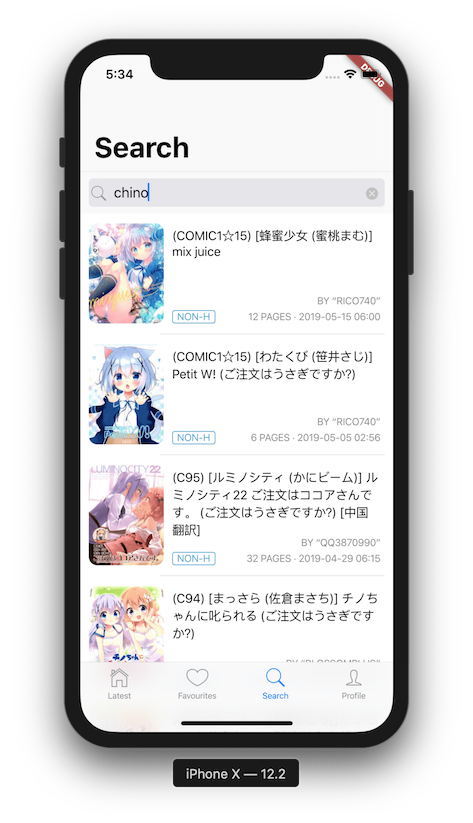
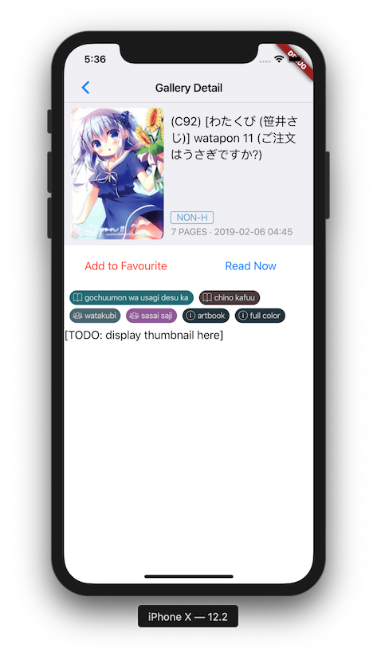

# ExViewer

An ExHentai viewer for iOS, built by Dart and Flutter, *for my personal use*.

 

## Usage

1. Install this app onto your iOS device. 

2. Go to `ExHentai → Settings` (at the top of the page), **create a new profile** with the following settings:
- `Front Page Settings`: `Thumbnail`
- `Search Result Count`: `25`
- `Thumbnail Settings → Size`: `Large`
- Feel free to adjust other settings, like `Excluded Categories` and `Excluded Languages`.
3. Save the new profile (“Save” button at the very bottom) **and set it as default**.
4. (Optional) Choose the old profile from the drop-down list and save again. This ensures that a different profile is used in your browser.
5. Check the first item in the Profile drop-down list. It should comply with the above settings and have a label “Default Profile”.
6. Run Ex-Viewer on your device and log in. Enjoy :)

## Todo items

- Better search experience: custom categories and most-used tags
- Favourites management: add and remove